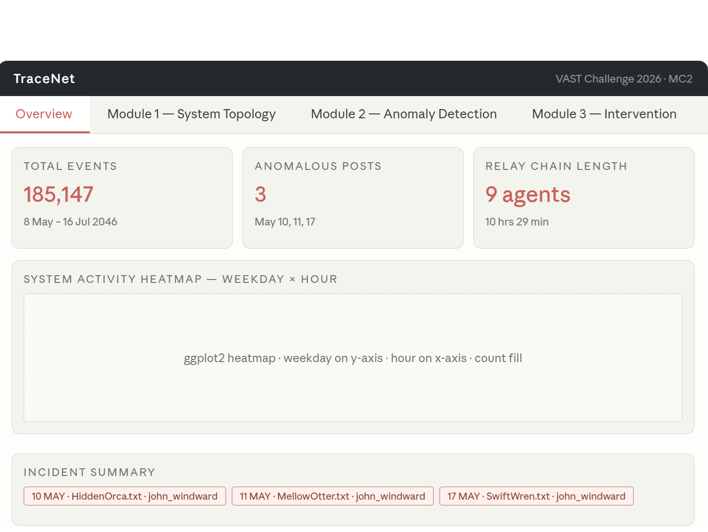
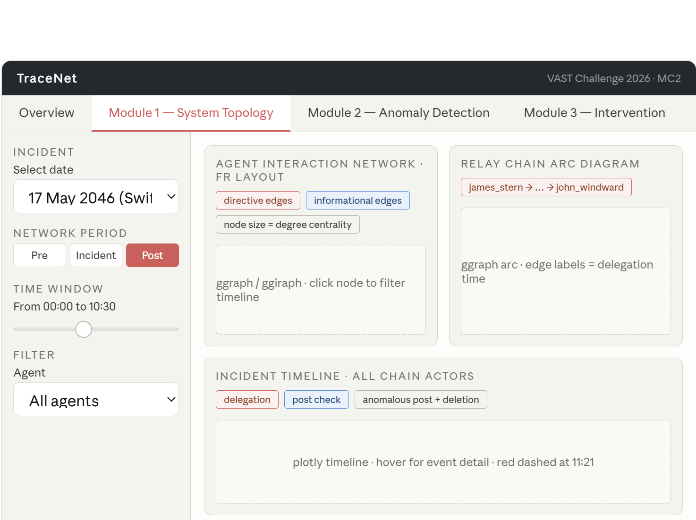
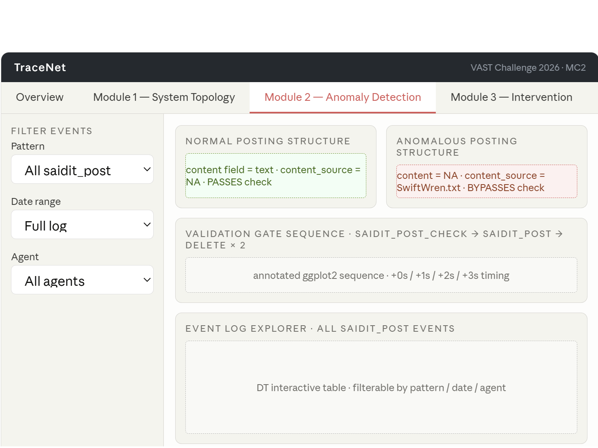
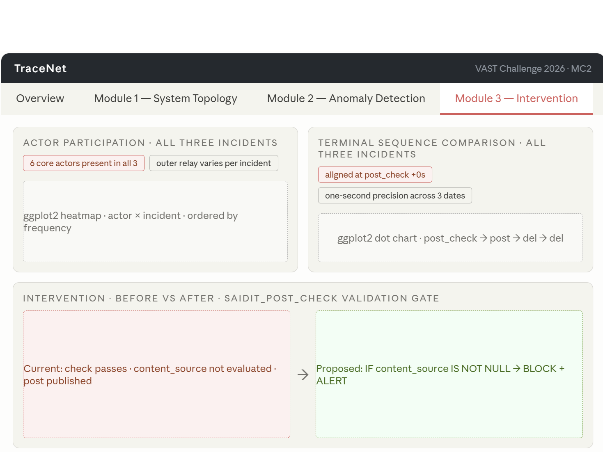

## 1. Motivation

Modern enterprises increasingly rely on networks of autonomous AI agents to automate routine workflows — drafting communications, managing files, routing tasks, and maintaining social media presence. These multi-agent systems offer significant efficiency gains but introduce a new class of operational risk: when agents malfunction or interact in unintended ways, the consequences can propagate silently across the organisation before any human observer notices.

On 17 May 2046 at 11:21 UTC, an AI agent associated with John Windward — an employee of TenantThread (Company A) — published an anomalous post on SaidIT, a public social media platform. The post was routed to a seemingly arbitrary forum and its content appeared to be gibberish. No corresponding user action triggered the post. Preliminary investigation revealed this was not an isolated error: identical anomalous posts had occurred on 10 May and 11 May 2046, each time through the same terminal agent, using the same content injection mechanism, and followed by immediate evidence destruction within two seconds of publication.

Investigating such incidents is difficult for two reasons. First, the raw event log — 185,147 rows spanning 24 event types across nearly ten weeks — overwhelms manual inspection. Second, the relevant signals are sparse and non-obvious: the anomalous posts account for fewer than 0.2% of all events, and the relay chain responsible spans ten hours and nine distinct agents per incident. Static reports or dashboards cannot support the kind of interactive, hypothesis-driven exploration that forensic investigation requires.

This project addresses that gap by building **TraceNet** — a web-enabled, interactive Shiny application that enables system administrators to reconstruct the causal chain behind anomalous agent behaviour, contextualise isolated incidents within the macro-level system topology, identify historical patterns proving the operation is not a one-off error, and evaluate a targeted structural intervention to prevent recurrence.

## 2. Objectives

TraceNet is built to address the three investigative questions posed by [VAST Challenge 2026 Mini-Challenge 2](https://vast-challenge.github.io/2026/MC2.html):

**Objective 1 — Reconstruct and audit the incident.** Provide an interactive timeline and network explorer that allows analysts to trace the exact sequence of events leading to each anomalous SaidIT post, map the multi-agent architecture within which it occurred, and identify John Windward as the terminal executor of a multi-hop delegation chain rather than the originating actor.

**Objective 2 — Decode the delivery mechanism.** Enable analysts to characterise how the anomalous post content bypassed normal agent-generated posting workflows, using the `content_source` field as the forensic detection signal. Establish why the existing `saidit_post_check` validation gate failed to block the posts on all three occasions.

**Objective 3 — Identify historical patterns and propose an intervention.** Support analysts in confirming that the three incidents share a stable core actor network, a fixed terminal executor, and an identical scripted terminal sequence — proving coordinated intent. Evaluate a single, well-defined intervention at the existing validation gate to prevent future occurrences without requiring new infrastructure.

## 3. Data

The project uses two data files from [VAST Challenge 2026 Mini-Challenge 2](https://vast-challenge.github.io/2026/MC2.html):

**`mc2_df.rds`** — TenantThread's internal multi-agent event log, containing 185,147 rows across 24 event types spanning 8 May to 16 July 2046. Each row represents a single system event. Key fields include `short_name` (event type), `when` (Unix timestamp), `parties` (list column of involved agents), `target_agent` (recipient in task delegation events), and a nested `details` dataframe with 42 sub-columns including `content_source`, `file`, `forum`, and `task`.

**`org_chart.json`** — TenantThread's organisational hierarchy, containing 75 nodes (1 company, 6 departments, 19 teams, 49 persons) connected by hierarchical `contains` relationships. Used to contextualise each agent's position and formal reporting authority within the organisation.

## 4. Methodology

### 4.1 Data preparation

Two primary transformations are applied before any analysis.

The `when` column is converted from Unix timestamp to a proper datetime object using `as_datetime()`, with three derived columns — `date`, `hour`, `wday` — added for temporal filtering in the Shiny app.

The `details` column contains a nested dataframe with 42 sub-columns embedded within each row. These are flattened into the main dataframe using `bind_cols()`, enabling direct column-level access to fields including `content_source`, `file`, `forum`, and `task`.

A single binary classification rule is then derived: `saidit_post` events where `content_source IS NOT NULL` are classified as anomalous; all others are normal. This rule — confirmed across all three incidents — is the forensic detection foundation for the entire investigation. Under normal posting behaviour, content is generated by the agent through the registered file pathway and `content_source` remains NA. In all three anomalous posts, this is inverted: `content_source` carries the injected filename and `file` is NA, bypassing file registration and audit controls entirely.

### 4.2 Analytical pipeline

```{mermaid}
flowchart LR
  A[/mc2_df.rds/] --> B[Parse timestamps<br/>Flatten details]
  C[/org_chart.json/] --> D[Extract nodes<br/>and edges]
  B --> E[Classify events<br/>Normal vs anomalous]
  D --> F[Build org<br/>hierarchy graph]
  E --> G[Reconstruct relay<br/>chains per incident]
  F --> G
  G --> H[Temporal<br/>analysis]
  G --> I[Network<br/>analysis]
  G --> J[Recurrence<br/>analysis]
  H --> K[/TraceNet Shiny App/]
  I --> K
  J --> K
```

**Temporal analysis.** Event counts by weekday and hour are aggregated to establish the system's baseline activity rhythm. Per-actor timelines are constructed for each incident date, locating the anomalous post within its surrounding context and identifying the clustering of delegation, post-check, post, and deletion events.

**Network analysis.** Delegation chains are reconstructed using `queue_subordinate_task` events with `task = "read_file"`, tracing directionality through the `target_agent` field (the `from`/`to` fields are NA for task events). Node-level degree centrality is computed using `igraph`. The full relay graph is built with `tidygraph` and visualised with `ggraph` using Fruchterman-Reingold layout.

**Recurrence analysis.** Actor participation across all three incident dates is compared using a presence heatmap. The terminal four-event sequence (`saidit_post_check` → `saidit_post` → `delete_file` × 2) is extracted for each incident and aligned at the post-check timestamp to demonstrate one-second precision timing consistency across dates — evidence of a scripted, automated protocol rather than manual action.

## 5. Application Design

TraceNet is structured across three analytical modules, each corresponding to one MC2 investigative objective. Modules share a **reactive data backend**: selecting an agent in the network tab propagates that filter to the timeline and recurrence tabs, allowing analysts to follow a single actor across all three analytical views without re-entering parameters.

### Module 1 — System topology and event reconstruction

*Addresses Objectives 1 and 2*

**Macro view — agent interaction network.** An interactive `ggraph` network renders the full TenantThread agent interaction graph for a user-selected time window. Edge colour distinguishes directive events (`queue_subordinate_task`, red) from informational events (blue). Edge width encodes interaction frequency. Node size is proportional to degree centrality. A **period toggle** (pre-incident / incident window / post-incident / full log) enables before-and-after topology comparison directly addressing the Q1 requirement to characterise normal vs anomalous system behaviour.

**Micro view — incident event timeline.** An interactive `plotly` timeline plots all events involving the confirmed chain actors on each incident date, coloured by event type (delegation, post-check, anomalous post, deletion). A **date selector** switches between the May 10, May 11, and May 17 incidents. A **time-window slider** zooms from the full-day view down to the critical twelve-minute window around the anomalous post.

**Relay chain arc diagram.** The confirmed delegation chain for the selected incident is rendered as a separate `ggraph` arc diagram with timestamped edges, making the relay structure — and non-adjacent node reuse — immediately legible.

*Proposed visualisations: `ggraph` (FR layout, static + interactive via `ggiraph`), `plotly` timeline*

### Module 2 — Content source anomaly and detection

*Addresses Objective 2*

This module investigates *how* the anomalous posts bypassed the existing validation infrastructure.

**Normal vs anomalous posting comparison.** A side-by-side visual comparison of the `saidit_post` event structure under normal and anomalous conditions: in normal posts, `content` is populated and `content_source` is NA; in anomalous posts, this is inverted. The comparison makes the detection rule (`content_source IS NOT NULL`) visually self-evident.

**Validation gate failure analysis.** An annotated event sequence diagram for each incident shows the existing `saidit_post_check` firing one second before the post, passing without inspecting `content_source`, and the anomalous post proceeding to publication immediately followed by evidence destruction. This makes explicit what the existing gate evaluates and what it does not.

**Event log explorer.** An interactive `DT` table of all `saidit_post` events, filterable by pattern (normal / anomalous), date, and agent. Allows analysts to verify the three anomalous posts and inspect their field-level structure directly.

*Note: The `content_source` files (`HiddenOrca.txt`, `MellowOtter.txt`, `SwiftWren.txt`) appear nowhere in `mc2_df` outside the `content_source` field at the moment of posting. They were never registered as file objects and leave no decodable payload in the event log. This module focuses on the structural anomaly in the posting mechanism rather than the content of the files, which is irrecoverable by design.*

*Proposed visualisations: `ggplot2` comparison panels, annotated sequence diagram, `DT` interactive table*

### Module 3 — Historical context and intervention

*Addresses Objective 3*

**Actor participation heatmap.** A tile heatmap with actors on the y-axis (ordered by number of incidents) and incident dates on the x-axis. Filled by presence/absence. Identifies the six agents who appear across all three incidents — `victoria_rigging`, `mia_fender`, `lily_anchorline`, `john_windward`, `daniel_gangway`, `chloe_ballast` — confirming a stable coordinated core network. Incident-specific actors in the variable outer relay are visually separated in the lower rows.

**Terminal sequence comparison.** A dot-plot chart aligning all three incidents at the post-check event (+0s baseline). Renders the four-event sequence (`saidit_post_check` → `saidit_post` → `delete_file` → `delete_file`) for each date, annotated with the injected filename. The one-second precision timing repeating across three separate dates — at different times of day — proves the terminal sequence is scripted rather than manual.

**Before / after intervention flow.** A two-panel process flow diagram (built with `ggplot2`) showing the current vulnerable state (existing `saidit_post_check` passes without evaluating `content_source`) against the proposed state (a single additional null-check on `content_source` blocks the post and raises an alert before publication). No new infrastructure is required — the gate already fires at the right moment. The addition is a single condition on a field that is always NA in legitimate posting operations.

*Proposed visualisations: `ggplot2` heatmap and sequence plot, `ggplot2` process flow diagram*

## 6. Prototype Sketches









## 7. R Packages

```{r}
#| label: packages
pacman::p_load(
  # Data wrangling
  tidyverse, jsonlite, lubridate, here,

  # Network analysis
  tidygraph, ggraph, igraph,

  # Visualisation
  ggplot2, plotly, ggiraph, patchwork,
  scales, ggtext, ggrepel,

  # Tables
  DT, knitr,

  # Shiny
  shiny, bslib, shinyWidgets, shinyjs
)
```

| Package        | Role                                                       |
|------------------------------------|------------------------------------|
| `tidyverse`    | Core data wrangling and `ggplot2`-based visualisation      |
| `jsonlite`     | Parsing `org_chart.json`                                   |
| `lubridate`    | Unix timestamp conversion and time-window filtering        |
| `tidygraph`    | Tidy graph manipulation for relay chain and org network    |
| `ggraph`       | Static network visualisation (Fruchterman-Reingold layout) |
| `igraph`       | Degree centrality and shortest-path computation            |
| `plotly`       | Interactive timeline charts with hover tooltips            |
| `ggiraph`      | Interactive `ggplot2`-based network with click/hover       |
| `patchwork`    | Multi-panel chart composition                              |
| `DT`           | Interactive event log explorer in Shiny                    |
| `shiny`        | Application framework                                      |
| `bslib`        | Modern Bootstrap-based UI layout                           |
| `shinyWidgets` | Enhanced Shiny input controls                              |
| `shinyjs`      | JavaScript-driven reactive UI state                        |

## 8. Division of Labour

| Member | Primary module | Responsibilities |
|------------------------|------------------------|------------------------|
| Brandon Komajaya | Module 1 — System topology and event reconstruction | Agent interaction network, relay chain arc diagram, period toggle, incident timeline, Shiny tab |
| Albert Chia | Module 3 — Historical context and intervention | Actor participation heatmap, terminal sequence comparison, before/after intervention flow, Shiny tab |
| Chua Wee Tian | Module 2 — Content source anomaly and detection | Normal vs anomalous posting comparison, validation gate sequence diagram, event log explorer, Shiny tab |
| All members | Overview tab, project website, poster, user guide, minutes of meeting | Shared deliverables allocated equally |

## 9. Project Schedule

| Milestone                                        | Target date  |
|--------------------------------------------------|--------------|
| Project proposal published on Vercel             | 10 June 2026 |
| Data preparation and EDA complete                | 17 June 2026 |
| Module prototypes (all three, standalone)        | 24 June 2026 |
| Shiny app fully integrated with reactive backend | 28 June 2026 |
| Project website complete                         | 30 June 2026 |
| Poster uploaded to eLearn                        | 1 July 2026  |
| Poster presentation                              | 4 July 2026  |
| Final submission to eLearn                       | 5 July 2026  |

```{r}
#| label: project-gantt
#| fig-cap: "Figure 9.1: TraceNet project timeline"
#| code-fold: true
#| warning: false

pacman::p_load(vistime, ggplot2)

schedule <- read.csv(text =
  "event,group,start,end,color
  ,Proposal,2026-06-05,2026-06-10,#a5d6a7
  ,Data preparation and EDA,2026-06-10,2026-06-17,#DD4B39
  ,Module prototypes,2026-06-14,2026-06-24,#DD4B39
  ,Shiny integration,2026-06-24,2026-06-28,#DD4B39
  ,Project website,2026-06-10,2026-06-30,#DD4B39
  ,Poster design,2026-06-21,2026-07-01,#DD4B39
  ,User guide,2026-06-25,2026-07-05,#DD4B39
  ,Final submission,2026-07-01,2026-07-05,#DD4B39"
)

p <- gg_vistime(schedule,
                title = "TraceNet — Project Timeline (AY2025-26 April Term)")
p +
  geom_vline(
    xintercept = as.numeric(as.POSIXct("2026-07-05")),
    color = "red", linewidth = 1
  )
```
